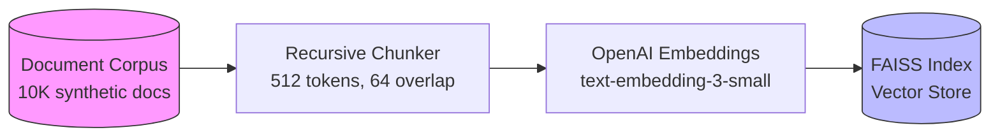
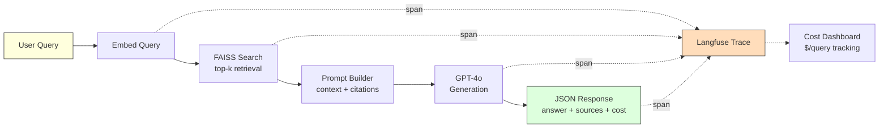
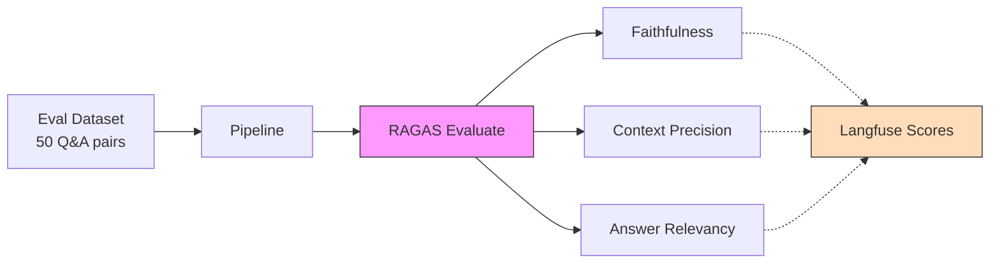

# RAG Ops

> Production-grade RAG pipeline (LangChain, FAISS, FastAPI) with Langfuse observability tracing, RAGAS evaluation metrics (faithfulness, context precision, answer relevance), prompt versioning, and cost-per-query monitoring.


**Author:** [Pranav Saravanan](https://github.com/pranavss722) | Built as part of a production ML engineering portfolio.

---

## Architecture

### Offline: Ingestion Pipeline



### Online: Query Pipeline



### Evaluation Loop



---

## Quick Start

```bash
# 1. Clone, install, configure
git clone https://github.com/pranavss722/rag-ops.git && cd rag-ops
pip install -e ".[dev]"
cp .env.example .env   # Add your OPENAI_API_KEY

# 2. Generate corpus + build index
python scripts/generate_corpus.py --num-docs 100 --seed 42
python scripts/ingest.py

# 3. Run
uvicorn app.main:app --reload
```

Send your first query:

```bash
curl -X POST http://localhost:8000/query \
  -H "Content-Type: application/json" \
  -d '{"question": "What is gradient descent?", "top_k": 3}'
```

### With Docker (full stack including Langfuse)

```bash
cp .env.example .env   # Add your OPENAI_API_KEY
docker compose up -d   # Starts app + Langfuse + Postgres + Redis
```

Langfuse dashboard: [http://localhost:3000](http://localhost:3000)

---

## API Reference

### `POST /query`

Submit a question to the RAG pipeline.

**Request:**

```json
{
  "question": "How does a load balancer distribute traffic?",
  "top_k": 5
}
```

**Response:**

```json
{
  "answer": "A load balancer distributes incoming network traffic across multiple servers... [doc_00033.txt] [doc_00079.txt]",
  "sources": [
    {"source": "doc_00033.txt", "score": 0.698},
    {"source": "doc_00009.txt", "score": 0.744},
    {"source": "doc_00042.txt", "score": 0.801}
  ],
  "trace_id": "abc-123-def",
  "latency_ms": 3682.79,
  "cost_usd": 0.001685
}
```

| Field | Type | Description |
|-------|------|-------------|
| `answer` | string | LLM-generated answer with source citations |
| `sources` | array | Retrieved chunks with FAISS distance scores |
| `trace_id` | string | Langfuse trace ID for debugging |
| `latency_ms` | float | End-to-end latency |
| `cost_usd` | float | Estimated cost (embedding + generation) |

### `GET /stats`

Aggregate metrics across all queries in the current session.

```json
{
  "total_queries": 12,
  "avg_latency_ms": 4100.50,
  "avg_cost_usd": 0.001542,
  "total_cost_usd": 0.018504
}
```

### `GET /health`

Returns `{"status": "ok"}` when the service is running.

---

## Evaluation Results

Evaluated on 50 synthetic Q&A pairs using [RAGAS](https://docs.ragas.io/):

| Metric | Score | Description |
|--------|-------|-------------|
| Faithfulness | _pending_ | Is the answer grounded in the retrieved context? |
| Context Precision | _pending_ | Are the retrieved chunks relevant to the question? |
| Answer Relevancy | _pending_ | Does the answer address the question asked? |

> Scores will be populated after running `python scripts/evaluate.py` with a live OpenAI key.

---

## Tech Stack

| Component | Technology | Purpose |
|-----------|-----------|---------|
| API Framework | FastAPI | Async REST endpoints |
| Orchestration | LangChain | Document loading, text splitting, embeddings |
| Vector Store | FAISS (faiss-cpu) | Similarity search over document chunks |
| Embeddings | OpenAI `text-embedding-3-small` | 1536-dim document/query vectors |
| Generation | OpenAI `gpt-4o` | Answer synthesis with citation grounding |
| Observability | Langfuse | Per-request tracing with 4 spans |
| Evaluation | RAGAS | Faithfulness, relevancy, precision metrics |
| Cost Tracking | Custom (token counting) | USD cost per query via model pricing table |
| Testing | pytest (34 tests) | TDD across all modules |
| Linting | Ruff | Fast Python linter + formatter |
| Infrastructure | Docker Compose | Langfuse + Postgres + Redis |

---

## Project Structure

```
rag-ops/
  app/
    main.py              FastAPI endpoints (/query, /stats, /health)
    ingestion.py          Document loading, chunking, FAISS index building
    retrieval.py          Query embedding + vector search + result schema
    generation.py         Prompt construction + LLM call + response schema
    tracing.py            Langfuse spans, cost calculation, pricing table
  scripts/
    generate_corpus.py    Synthetic technical corpus generator (seeded)
    ingest.py             End-to-end ingestion CLI (load -> chunk -> embed -> save)
    generate_eval_set.py  RAGAS evaluation dataset (50 Q&A pairs)
    evaluate.py           RAGAS evaluation runner + Langfuse score push
    healthcheck.py        Docker HEALTHCHECK script
    codex_audit.py        AI-powered code review (pre-commit hook)
  tests/                  34 TDD tests across 8 test files
  data/
    corpus/               Generated .txt documents (gitignored)
    faiss_index/          Persisted FAISS vectors (gitignored)
  DESIGN.md              Architectural decisions
  ARCHITECTURE.md         Module responsibilities + data flow
  PLAN.md                Implementation plan (9 milestones, 28 tasks)
  Dockerfile             Multi-stage Python 3.11 build
  docker-compose.yml      App + Langfuse + Postgres + Redis
```

---

## Development

```bash
# Run tests
pytest -xvs

# Lint + format
ruff check --fix . && ruff format .

# Generate full 10K corpus
python scripts/generate_corpus.py --num-docs 10000 --seed 42
```

See [ARCHITECTURE.md](ARCHITECTURE.md) for design decisions and [PLAN.md](PLAN.md) for the implementation roadmap.

---

## License

MIT
